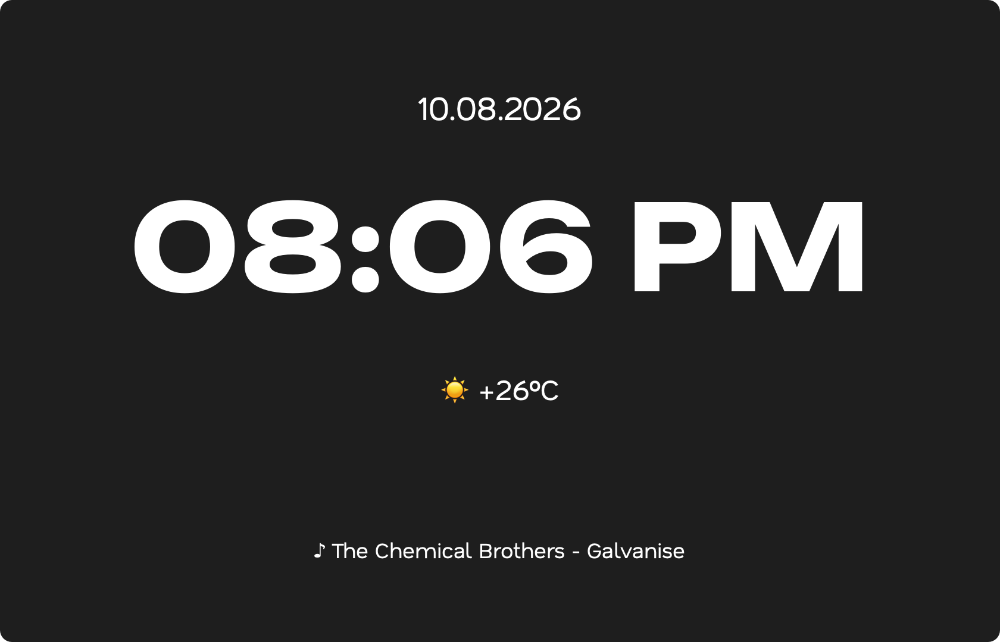

<div align="center">
    <pre>
    __         .__                 __    
    |  | __ ____ |  |   ____  ____ |  | __
    |  |/ // ___\|  |  /  _ \/ ___\|  |/ /
    |    <\  \___|  |_(  <_> )  \__|    < 
    |__|_ \\___  >____/\____/ \___  >__|_ \
        \/    \/                 \/     \/
    </pre>
</div>
<p align="center">
    A desktop widget for ktools.
</p>
<p align="center">
    
    
</p>

⠀

## What is kclock?

`kclock` is a simple add-on widget for the `kpaper` engine. It displays the time, date, local weather, and currently playing music directly on your desktop layer. It's entirely passive, meaning it ignores mouse events and sits securely behind all your windows and desktop icons.

### Core Features
* **Desktop Layer Injection**: Leverages the `kpaper` backend to render itself directly onto the macOS desktop.
* **Modular Display**: Toggle the Time, Date, Live Weather (via `wttr.in`), and Music (via `nowplaying-cli`) modules on or off.
* **Sleep-Safe**: Automatically destroys its UI and background threads when macOS goes to sleep, preventing unexpected PyQt crashes on wake.

⠀

## Screenshots section



⠀

## How to Use (For Users)

1. Make sure you have the **kpaper** plugin installed and enabled in `ktools` first, as `kclock` relies on its spawning pipeline for rendering.
2. Install `nowplaying-cli` via Homebrew (`brew install nowplaying-cli`). This is **mandatory** if you want the Music module to work.
3. Download the `kclock` `.zip` archive from the Releases page.
4. Open the **ktools Plugin Manager** from your menu bar and click **import plugins** to install it.
5. Expand `kpaperaddon_kclock` in the manager to see all available settings. Use the buttons (e.g., `toggle clock`, `change city`, `change color`) to customize your widget.
6. The widget will instantly hot-reload with your new settings.

⠀

## API & Architecture (For Addon Developers)

While `kpaper` handles the rendering, `kclock` serves as the official reference implementation for how to build background widgets safely. If you are building an addon that fetches data from the internet or runs continuous polling loops on the desktop layer, you must handle threading and sleep states carefully.

### 1. The Sleep Trapping Rule
**Rule:** Background data widgets must destroy themselves or pause their timers when macOS goes to sleep.
**Why:** If your widget leaves `QTimer` instances or `urllib.request` threads running while the Mac goes to sleep, the system freezes those threads abruptly. When the Mac wakes up, those threads can cause PyQt to crash. 

`kclock` listens for sleep notifications and destroys its widget:
```python
self.workspace_center = NSWorkspace.sharedWorkspace().notificationCenter()
self.workspace_center.addObserver_selector_name_object_(
    self, "handleSleep:", "NSWorkspaceWillSleepNotification", None
)
self.workspace_center.addObserver_selector_name_object_(
    self, "handleWake:", "NSWorkspaceDidWakeNotification", None
)

def handleSleep_(self, notification):
    self._safe_destroy_widget() # Destroy the UI and all QTimers

def handleWake_(self, notification):
    QTimer.singleShot(3000, self.hard_refresh_widget) # Rebuild the widget after wake
```

### 2. Thread Safety
**Rule:** Never update UI components directly from background threads (like the `WeatherThread` or `NowPlayingThread`).
**Why:** Qt strictly requires all UI updates to happen on the main thread. `kclock` uses PyQt Signals (`self.data_ready.emit(data)`) to safely pass the string back to the main thread where `self.weather_label.setText()` is called.

### 3. Interfacing with kpaper
**Rule:** Use `ktools.plugins.get('kpaper')` to fetch the active `kpaper` instance and inject your widget.
**Why:** `kpaper` handles all the complex PyObjC desktop layer injection for you. You just need to pass it your PyQt widget.

`kclock` does this seamlessly:
```python
# 1. Get the kpaper plugin instance
kp = self.ktools.plugins.get('kpaper')

if kp and hasattr(kp, 'spawn_widget'):
    # 2. Spawn the widget using a lambda, marking it as non-interactive (so it ignores clicks)
    self.widget = kp.spawn_widget(lambda kt: ClockWidget(kt, self.config), interactive=False)
    
    if self.widget:
        # 3. Ask kpaper which monitor it's currently rendering on
        screen = kp.get_target_screen_geometry()
        
        # 4. Position your widget accordingly
        self.widget.move(screen.x() + ..., screen.y() + ...)
```

by kriaiss.
