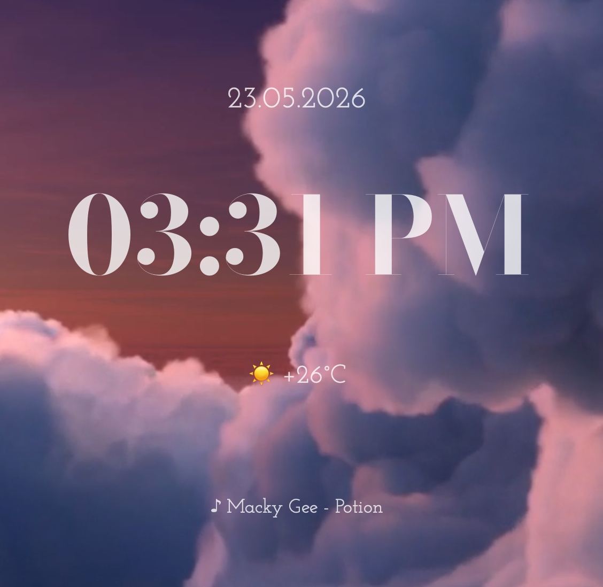
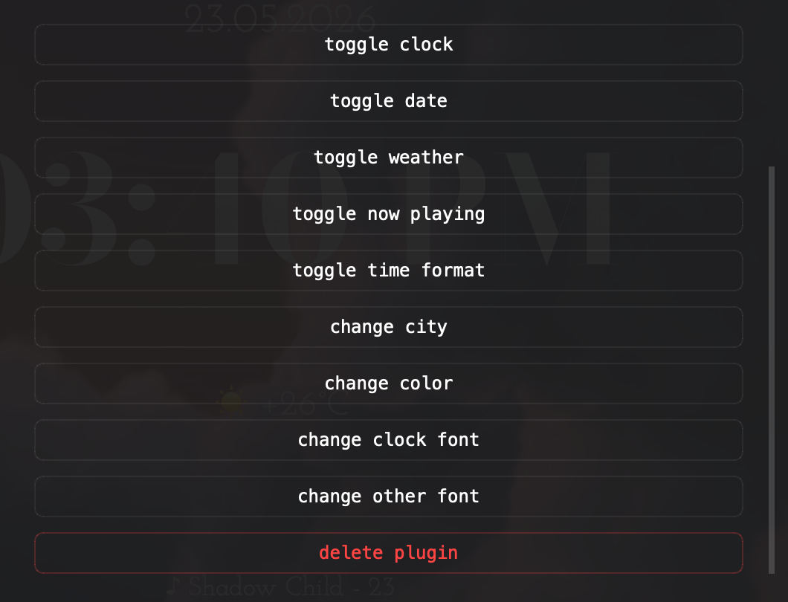

    <pre>
    ____  __._________ .____    ________  _________  ____  __.
    |    |/ _|\_   ___ \|    |   \_____  \ \_   ___ \|    |/ _|
    |      <  /    \  \/|    |    /   |   \/    \  \/|      <  
    |    |  \ \     \___|    |___/    |    \     \___|    |  \ 
    |____|__ \ \______  /_______ \_______  /\______  /____|__ \
            \/        \/        \/       \/        \/        \/
    </pre>

    info-widget for kpaper. 
    it sits on ur desktop and handles the clock, date, weather, and current media track.

    
    

⠀

# what is this?

kclock is the standard info-widget for kpaper. it sits on ur desktop and handles the clock, date, weather, and current media track. it’s not just a QLabel hell; it’s a managed lifecycle plugin that actually respects the system’s sleep/wake states.

### features

* atomic updates: individual timers for time (1s), music (2s), and weather (15m) ensure the CPU isn't melting for a clock widget.
* native power management: uses NSWorkspace observers to nuke threads on sleep and re-spawn on wake.
* config-first: everything is togglable via plugin manager or kpaperaddon_kclock.json. if it's disabled in the json, the widget won't waste memory rendering it.

### nowplaying-cli is required!

⠀

# configuration

the kpaperaddon_kclock.json dictates everything. u can set it up using buttons in ktools plugin manager.

* toogle clock.
* toogle date.
* toogle weather.
* toogle now playing.
* toogle time format: 24h or am/pm system.
* change city: city for wttr.in.
* change color: rgba string for text.
* change clock font: font for time.
* change other font: font for metadata.

### final thoughts

use this addon as a sample for kpaper widgets.

i made that coz system widgets is bored lol.

by kriaiss.